# [📈 Live Status](https://jonesyriffic.github.io/gsp-smx): <!--live status--> **🟩 All systems operational**

This repository contains the open-source uptime monitor and status page for [Andrew Jones](https://jonesyriffic.github.io/gsp-smx), powered by [Upptime](https://github.com/upptime/upptime).

With [Upptime](https://upptime.js.org), you can get your own unlimited and free uptime monitor and status page, powered entirely by a GitHub repository. We use [Issues](https://github.com/jonesyriffic/gsp-smx/issues) as incident reports, [Actions](https://github.com/jonesyriffic/gsp-smx/actions) as uptime monitors, and [Pages](https://jonesyriffic.github.io/gsp-smx) for the status page.

<!--start: status pages-->
<!-- This summary is generated by Upptime (https://github.com/upptime/upptime) -->
<!-- Do not edit this manually, your changes will be overwritten -->
<!-- prettier-ignore -->
| URL | Status | History | Response Time | Uptime |
| --- | ------ | ------- | ------------- | ------ |
|  [AO - Angola](https://www.showmax.com/ao/help) | 🟩 Up | [ao-angola.yml](https://github.com/jonesyriffic/gsp-smx/commits/HEAD/history/ao-angola.yml) | 

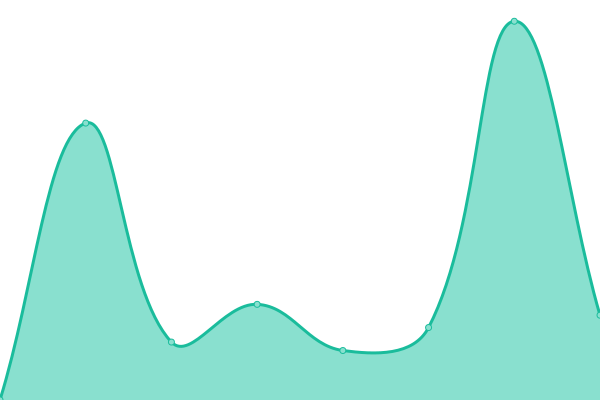 2474ms
     
 | 

<a href="https://jonesyriffic.github.io/gsp-smx/history/ao-angola">100.00%</a>
    

|  [BJ - Benin](https://www.showmax.com/bj/help) | 🟩 Up | [bj-benin.yml](https://github.com/jonesyriffic/gsp-smx/commits/HEAD/history/bj-benin.yml) | 

 1266ms
     
 | 

<a href="https://jonesyriffic.github.io/gsp-smx/history/bj-benin">100.00%</a>
    

|  [BW - Botswana](https://www.showmax.com/bw/help) | 🟩 Up | [bw-botswana.yml](https://github.com/jonesyriffic/gsp-smx/commits/HEAD/history/bw-botswana.yml) | 

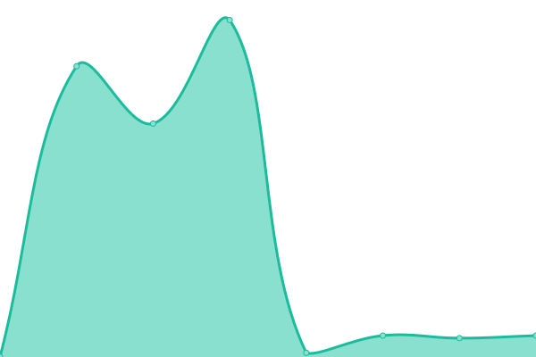 884ms
     
 | 

<a href="https://jonesyriffic.github.io/gsp-smx/history/bw-botswana">100.00%</a>
    

|  [BF - Burkina Faso](https://www.showmax.com/bf/help) | 🟩 Up | [bf-burkina-faso.yml](https://github.com/jonesyriffic/gsp-smx/commits/HEAD/history/bf-burkina-faso.yml) | 

 930ms
     
 | 

<a href="https://jonesyriffic.github.io/gsp-smx/history/bf-burkina-faso">100.00%</a>
    

|  [CV - Cabo Verde](https://www.showmax.com/cv/help) | 🟩 Up | [cv-cabo-verde.yml](https://github.com/jonesyriffic/gsp-smx/commits/HEAD/history/cv-cabo-verde.yml) | 

 1492ms
     
 | 

<a href="https://jonesyriffic.github.io/gsp-smx/history/cv-cabo-verde">100.00%</a>
    

|  [CM - Cameroon](https://www.showmax.com/cm/help) | 🟩 Up | [cm-cameroon.yml](https://github.com/jonesyriffic/gsp-smx/commits/HEAD/history/cm-cameroon.yml) | 

 1429ms
     
 | 

<a href="https://jonesyriffic.github.io/gsp-smx/history/cm-cameroon">100.00%</a>
    

|  [CF - Central African Republic](https://www.showmax.com/cf/help) | 🟩 Up | [cf-central-african-republic.yml](https://github.com/jonesyriffic/gsp-smx/commits/HEAD/history/cf-central-african-republic.yml) | 

 927ms
     
 | 

<a href="https://jonesyriffic.github.io/gsp-smx/history/cf-central-african-republic">100.00%</a>
    

|  [TD - Chad](https://www.showmax.com/td/help) | 🟩 Up | [td-chad.yml](https://github.com/jonesyriffic/gsp-smx/commits/HEAD/history/td-chad.yml) | 

 1626ms
     
 | 

<a href="https://jonesyriffic.github.io/gsp-smx/history/td-chad">100.00%</a>
    

|  [KM - Comoros](https://www.showmax.com/km/help) | 🟩 Up | [km-comoros.yml](https://github.com/jonesyriffic/gsp-smx/commits/HEAD/history/km-comoros.yml) | 

 714ms
     
 | 

<a href="https://jonesyriffic.github.io/gsp-smx/history/km-comoros">100.00%</a>
    

|  [CG - Congo](https://www.showmax.com/cg/help) | 🟩 Up | [cg-congo.yml](https://github.com/jonesyriffic/gsp-smx/commits/HEAD/history/cg-congo.yml) | 

 712ms
     
 | 

<a href="https://jonesyriffic.github.io/gsp-smx/history/cg-congo">100.00%</a>
    

|  [CI - Côte d'Ivoire](https://www.showmax.com/ci/help) | 🟩 Up | [ci-cote-d-ivoire.yml](https://github.com/jonesyriffic/gsp-smx/commits/HEAD/history/ci-cote-d-ivoire.yml) | 

 1156ms
     
 | 

<a href="https://jonesyriffic.github.io/gsp-smx/history/ci-cote-d-ivoire">100.00%</a>
    

|  [CD - Democratic Republic of the Congo](https://www.showmax.com/cd/help) | 🟩 Up | [cd-democratic-republic-of-the-congo.yml](https://github.com/jonesyriffic/gsp-smx/commits/HEAD/history/cd-democratic-republic-of-the-congo.yml) | 

 788ms
     
 | 

<a href="https://jonesyriffic.github.io/gsp-smx/history/cd-democratic-republic-of-the-congo">100.00%</a>
    

|  [DJ - Djibouti](https://www.showmax.com/dj/help) | 🟩 Up | [dj-djibouti.yml](https://github.com/jonesyriffic/gsp-smx/commits/HEAD/history/dj-djibouti.yml) | 

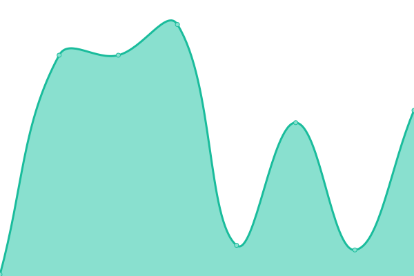 858ms
     
 | 

<a href="https://jonesyriffic.github.io/gsp-smx/history/dj-djibouti">100.00%</a>
    

|  [GQ - Equatorial Guinea](https://www.showmax.com/gq/help) | 🟩 Up | [gq-equatorial-guinea.yml](https://github.com/jonesyriffic/gsp-smx/commits/HEAD/history/gq-equatorial-guinea.yml) | 

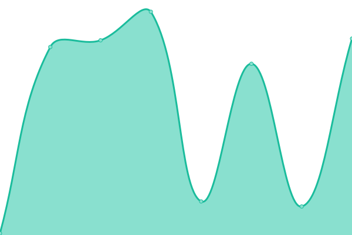 1084ms
     
 | 

<a href="https://jonesyriffic.github.io/gsp-smx/history/gq-equatorial-guinea">100.00%</a>
    

|  [ER - Eritrea](https://www.showmax.com/er/help) | 🟩 Up | [er-eritrea.yml](https://github.com/jonesyriffic/gsp-smx/commits/HEAD/history/er-eritrea.yml) | 

 1120ms
     
 | 

<a href="https://jonesyriffic.github.io/gsp-smx/history/er-eritrea">100.00%</a>
    

|  [SZ - Eswatini](https://www.showmax.com/sz/help) | 🟩 Up | [sz-eswatini.yml](https://github.com/jonesyriffic/gsp-smx/commits/HEAD/history/sz-eswatini.yml) | 

 821ms
     
 | 

<a href="https://jonesyriffic.github.io/gsp-smx/history/sz-eswatini">100.00%</a>
    

|  [ET - Ethiopia](https://www.showmax.com/et/help) | 🟩 Up | [et-ethiopia.yml](https://github.com/jonesyriffic/gsp-smx/commits/HEAD/history/et-ethiopia.yml) | 

 1093ms
     
 | 

<a href="https://jonesyriffic.github.io/gsp-smx/history/et-ethiopia">100.00%</a>
    

|  [GA - Gabon](https://www.showmax.com/ga/help) | 🟩 Up | [ga-gabon.yml](https://github.com/jonesyriffic/gsp-smx/commits/HEAD/history/ga-gabon.yml) | 

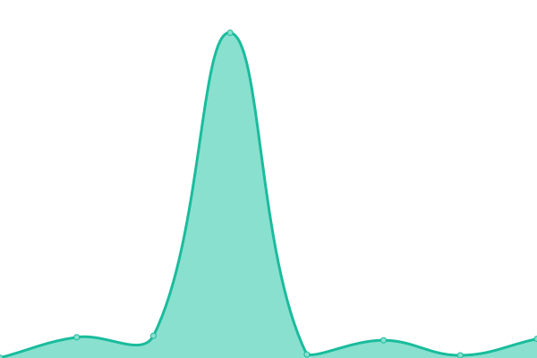 858ms
     
 | 

<a href="https://jonesyriffic.github.io/gsp-smx/history/ga-gabon">100.00%</a>
    

|  [GM - Gambia](https://www.showmax.com/gm/help) | 🟩 Up | [gm-gambia.yml](https://github.com/jonesyriffic/gsp-smx/commits/HEAD/history/gm-gambia.yml) | 

 766ms
     
 | 

<a href="https://jonesyriffic.github.io/gsp-smx/history/gm-gambia">100.00%</a>
    

|  [GH - Ghana](https://www.showmax.com/gh/help) | 🟩 Up | [gh-ghana.yml](https://github.com/jonesyriffic/gsp-smx/commits/HEAD/history/gh-ghana.yml) | 

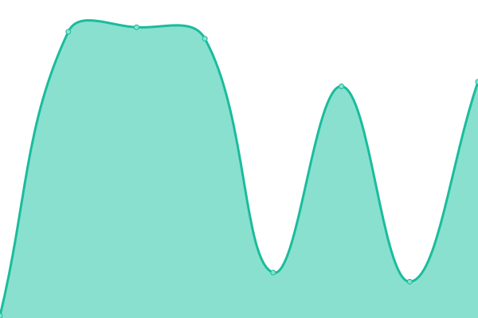 912ms
     
 | 

<a href="https://jonesyriffic.github.io/gsp-smx/history/gh-ghana">100.00%</a>
    

|  [GN - Guinea](https://www.showmax.com/gn/help) | 🟩 Up | [gn-guinea.yml](https://github.com/jonesyriffic/gsp-smx/commits/HEAD/history/gn-guinea.yml) | 

 778ms
     
 | 

<a href="https://jonesyriffic.github.io/gsp-smx/history/gn-guinea">100.00%</a>
    

|  [GW - Guinea Bissau](https://www.showmax.com/gw/help) | 🟩 Up | [gw-guinea-bissau.yml](https://github.com/jonesyriffic/gsp-smx/commits/HEAD/history/gw-guinea-bissau.yml) | 

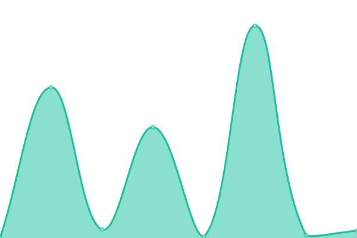 1118ms
     
 | 

<a href="https://jonesyriffic.github.io/gsp-smx/history/gw-guinea-bissau">100.00%</a>
    

|  [KE - Kenya](https://www.showmax.com/ke/help) | 🟩 Up | [ke-kenya.yml](https://github.com/jonesyriffic/gsp-smx/commits/HEAD/history/ke-kenya.yml) | 

 1029ms
     
 | 

<a href="https://jonesyriffic.github.io/gsp-smx/history/ke-kenya">100.00%</a>
    

|  [LS - Lesotho](https://www.showmax.com/ls/help) | 🟩 Up | [ls-lesotho.yml](https://github.com/jonesyriffic/gsp-smx/commits/HEAD/history/ls-lesotho.yml) | 

 1375ms
     
 | 

<a href="https://jonesyriffic.github.io/gsp-smx/history/ls-lesotho">100.00%</a>
    

|  [MG - Madagascar](https://www.showmax.com/mg/help) | 🟩 Up | [mg-madagascar.yml](https://github.com/jonesyriffic/gsp-smx/commits/HEAD/history/mg-madagascar.yml) | 

 697ms
     
 | 

<a href="https://jonesyriffic.github.io/gsp-smx/history/mg-madagascar">100.00%</a>
    

|  [MW - Malawi](https://www.showmax.com/mw/help) | 🟩 Up | [mw-malawi.yml](https://github.com/jonesyriffic/gsp-smx/commits/HEAD/history/mw-malawi.yml) | 

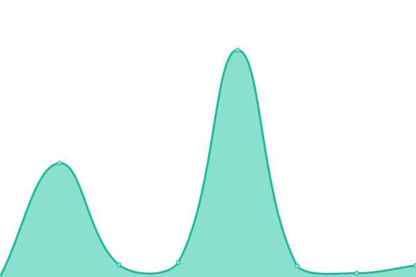 1035ms
     
 | 

<a href="https://jonesyriffic.github.io/gsp-smx/history/mw-malawi">100.00%</a>
    

|  [ML - Mali](https://www.showmax.com/ml/help) | 🟩 Up | [ml-mali.yml](https://github.com/jonesyriffic/gsp-smx/commits/HEAD/history/ml-mali.yml) | 

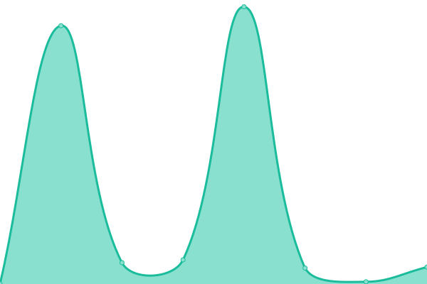 1433ms
     
 | 

<a href="https://jonesyriffic.github.io/gsp-smx/history/ml-mali">100.00%</a>
    

|  [MR - Mauritania](https://www.showmax.com/mr/help) | 🟩 Up | [mr-mauritania.yml](https://github.com/jonesyriffic/gsp-smx/commits/HEAD/history/mr-mauritania.yml) | 

 1147ms
     
 | 

<a href="https://jonesyriffic.github.io/gsp-smx/history/mr-mauritania">100.00%</a>
    

|  [MU - Mauritius](https://www.showmax.com/mu/help) | 🟩 Up | [mu-mauritius.yml](https://github.com/jonesyriffic/gsp-smx/commits/HEAD/history/mu-mauritius.yml) | 

 1213ms
     
 | 

<a href="https://jonesyriffic.github.io/gsp-smx/history/mu-mauritius">100.00%</a>
    

|  [MZ - Mozambique](https://www.showmax.com/mz/help) | 🟩 Up | [mz-mozambique.yml](https://github.com/jonesyriffic/gsp-smx/commits/HEAD/history/mz-mozambique.yml) | 

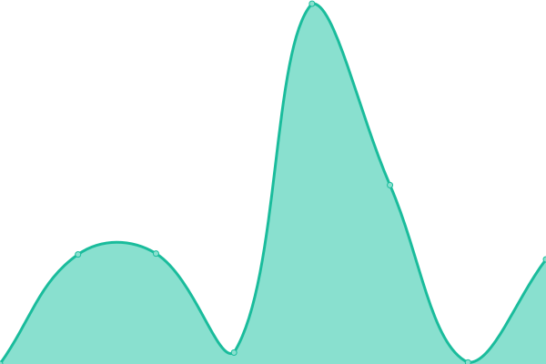 1316ms
     
 | 

<a href="https://jonesyriffic.github.io/gsp-smx/history/mz-mozambique">100.00%</a>
    

|  [NA - Namibia](https://www.showmax.com/na/help) | 🟩 Up | [na-namibia.yml](https://github.com/jonesyriffic/gsp-smx/commits/HEAD/history/na-namibia.yml) | 

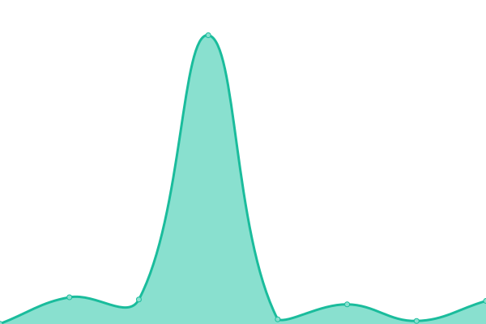 685ms
     
 | 

<a href="https://jonesyriffic.github.io/gsp-smx/history/na-namibia">100.00%</a>
    

|  [NE - Niger](https://www.showmax.com/ne/help) | 🟩 Up | [ne-niger.yml](https://github.com/jonesyriffic/gsp-smx/commits/HEAD/history/ne-niger.yml) | 

 1065ms
     
 | 

<a href="https://jonesyriffic.github.io/gsp-smx/history/ne-niger">100.00%</a>
    

|  [NG - Nigeria](https://www.showmax.com/ng/help) | 🟩 Up | [ng-nigeria.yml](https://github.com/jonesyriffic/gsp-smx/commits/HEAD/history/ng-nigeria.yml) | 

 526ms
     
 | 

<a href="https://jonesyriffic.github.io/gsp-smx/history/ng-nigeria">100.00%</a>
    

|  [RW - Rwanda](https://www.showmax.com/rw/help) | 🟩 Up | [rw-rwanda.yml](https://github.com/jonesyriffic/gsp-smx/commits/HEAD/history/rw-rwanda.yml) | 

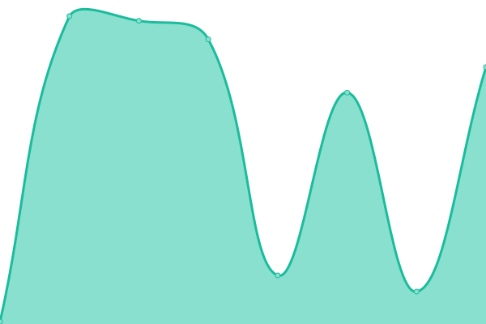 1125ms
     
 | 

<a href="https://jonesyriffic.github.io/gsp-smx/history/rw-rwanda">100.00%</a>
    

|  [ST - Sao Tome & Principe](https://www.showmax.com/st/help) | 🟩 Up | [st-sao-tome-and-principe.yml](https://github.com/jonesyriffic/gsp-smx/commits/HEAD/history/st-sao-tome-and-principe.yml) | 

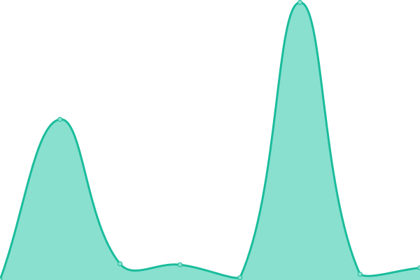 1269ms
     
 | 

<a href="https://jonesyriffic.github.io/gsp-smx/history/st-sao-tome-and-principe">100.00%</a>
    

|  [SN - Senegal](https://www.showmax.com/sn/help) | 🟩 Up | [sn-senegal.yml](https://github.com/jonesyriffic/gsp-smx/commits/HEAD/history/sn-senegal.yml) | 

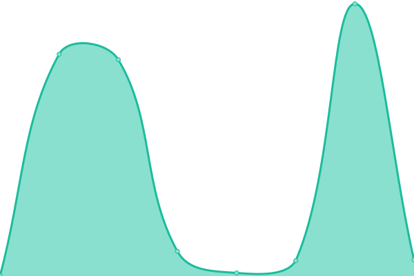 797ms
     
 | 

<a href="https://jonesyriffic.github.io/gsp-smx/history/sn-senegal">100.00%</a>
    

|  [SC - Seychelles](https://www.showmax.com/sc/help) | 🟩 Up | [sc-seychelles.yml](https://github.com/jonesyriffic/gsp-smx/commits/HEAD/history/sc-seychelles.yml) | 

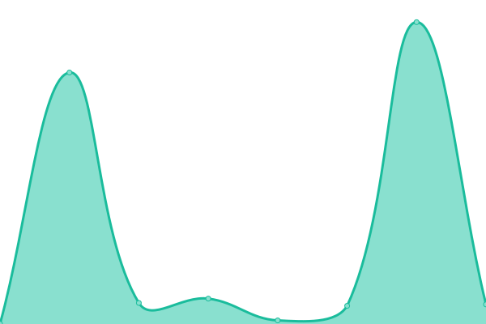 687ms
     
 | 

<a href="https://jonesyriffic.github.io/gsp-smx/history/sc-seychelles">100.00%</a>
    

|  [SL - Sierra Leone](https://www.showmax.com/sl/help) | 🟩 Up | [sl-sierra-leone.yml](https://github.com/jonesyriffic/gsp-smx/commits/HEAD/history/sl-sierra-leone.yml) | 

 675ms
     
 | 

<a href="https://jonesyriffic.github.io/gsp-smx/history/sl-sierra-leone">100.00%</a>
    

|  [ZA - South Africa](https://www.showmax.com/za/help) | 🟩 Up | [za-south-africa.yml](https://github.com/jonesyriffic/gsp-smx/commits/HEAD/history/za-south-africa.yml) | 

 589ms
     
 | 

<a href="https://jonesyriffic.github.io/gsp-smx/history/za-south-africa">100.00%</a>
    

|  [TZ - Tanzania](https://www.showmax.com/tz/help) | 🟩 Up | [tz-tanzania.yml](https://github.com/jonesyriffic/gsp-smx/commits/HEAD/history/tz-tanzania.yml) | 

 932ms
     
 | 

<a href="https://jonesyriffic.github.io/gsp-smx/history/tz-tanzania">100.00%</a>
    

|  [TG - Togo](https://www.showmax.com/tg/help) | 🟩 Up | [tg-togo.yml](https://github.com/jonesyriffic/gsp-smx/commits/HEAD/history/tg-togo.yml) | 

 1374ms
     
 | 

<a href="https://jonesyriffic.github.io/gsp-smx/history/tg-togo">100.00%</a>
    

|  [UG - Uganda](https://www.showmax.com/ug/help) | 🟩 Up | [ug-uganda.yml](https://github.com/jonesyriffic/gsp-smx/commits/HEAD/history/ug-uganda.yml) | 

 1048ms
     
 | 

<a href="https://jonesyriffic.github.io/gsp-smx/history/ug-uganda">100.00%</a>
    

|  [ZM - Zambia](https://www.showmax.com/zm/help) | 🟩 Up | [zm-zambia.yml](https://github.com/jonesyriffic/gsp-smx/commits/HEAD/history/zm-zambia.yml) | 

 648ms
     
 | 

<a href="https://jonesyriffic.github.io/gsp-smx/history/zm-zambia">100.00%</a>
    

|  [ZW - Zimbabwe](https://www.showmax.com/zw/help) | 🟩 Up | [zw-zimbabwe.yml](https://github.com/jonesyriffic/gsp-smx/commits/HEAD/history/zw-zimbabwe.yml) | 

 1354ms
     
 | 

<a href="https://jonesyriffic.github.io/gsp-smx/history/zw-zimbabwe">100.00%</a>
    

<!--end: status pages-->

[**Visit our status website →**](https://jonesyriffic.github.io/gsp-smx)

## 📄 License

- Powered by: [Upptime](https://github.com/upptime/upptime)
- Code: [MIT](./LICENSE) © [Anand Chowdhary](https://anandchowdhary.com), supported by [Pabio](https://pabio.com)
- Data in the `./history` directory: [Open Database License](https://opendatacommons.org/licenses/odbl/1-0/)
